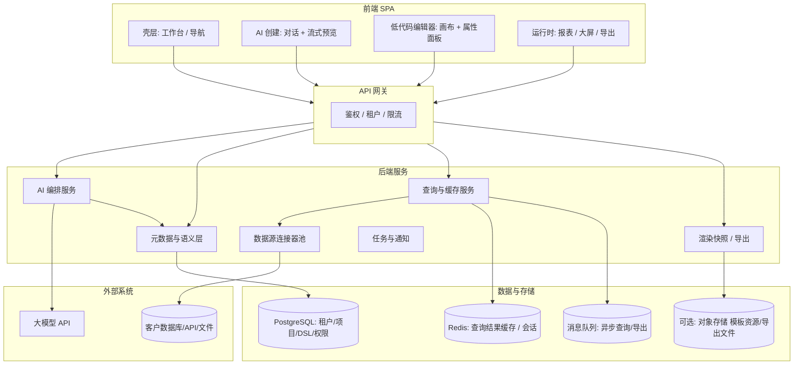

# AI 智能报表平台 — 详细开发方案

> 与 HTML 交互稿配套：`design-mockup.html`（工作台、AI 创建、模版中心、报表编辑、数据源、大屏预览）。

---

## 1. 产品定位与对标

| 维度 | 积木报表 / 帆软 | Power BI | Gamma（形态参考） | 本产品（AiReport） |
|------|-----------------|----------|-------------------|---------------------|
| 核心路径 | 拖拽 + SQL/数据集配置 | 建模 + 可视化 | 对话 + 幻灯片式生成 | **语义驱动 + 模版加速 + 可视化精修** |
| 大屏 | 强（帆软/积木） | 弱 | 非主场景 | **报表与大屏同一套 DSL，主题与布局可切换** |
| 数据接入 | 连接器丰富，偏手工 | 企业级连接器 | 上传/简单源 | **连接器 + 自动发现元数据 + AI 字段映射** |
| 上手成本 | 中高 | 中高 | 低 | **低：默认「描述即生成」，进阶才进编辑器** |

**一句话**：在「帆软/积木级」的报表与大屏能力边界内，用 **Gamma 式对话主路径** 降低门槛，用 **PowerBI 式语义层** 保证指标一致性与复用，用 **模版市场** 覆盖行业快速适配。

---

## 2. 目标用户与核心场景

- **业务用户**：用自然语言生成月度报表、活动复盘、领导看板；几乎不写 SQL。
- **数据分析师**：接好数据源与语义层后，用 AI 出初稿，再在编辑器里调布局、钻取、权限。
- **实施/交付**：选模版 → 绑定客户库 → 自动映射字段 → 微调主题与 KPI 口径 → 交付。

**成功标准**：从「一句话需求」到「可刷新的可发布报表/大屏」在 **10 分钟内** 完成（在数据源已连通的前提下）。

---

## 3. 总体架构



**设计原则**：

- **DSL 为中心**：报表/大屏统一用一份 JSON Schema（布局、组件、数据绑定、主题、刷新策略），AI 与编辑器操作同一模型，避免「生成页」与「编辑页」两套结构。
- **查询与展示分离**：浏览器只拿「已聚合的小结果集」或「分页游标」；重型计算在 QuerySvc，可下推数据库或 OLAP。
- **租户隔离**：连接串、凭证、缓存键、语义层全部带 `tenant_id`。

---

## 4. 核心模块说明

### 4.1 AI 编排服务（对标 Gamma 的「生成流」）

**流水线阶段**：

1. **意图解析**：报表 vs 大屏、行业模版候选、时间粒度、对比口径（同比/环比）。
2. **数据源推断**：根据租户已连接的数据源 + 表/字段注释 + 历史数据集，给出「推荐绑定」；不确定时向用户 **最多 1～2 个澄清问题**（可选项，保持傻瓜式）。
3. **语义层匹配**：将用户口中的「销售额、GMV、客单价」映射到度量（Measure）与维度（Dimension）；缺失则建议新建计算字段（带预览 SQL）。
4. **布局规划**：大屏采用栅格 + 自适应缩放策略；打印报表采用分页流式布局。
5. **DSL 生成**：输出符合 Schema 的 JSON，并附带 **可解释摘要**（用了哪些表、哪些指标、哪些筛选）。
6. **校验与修复**：Schema 校验 → 试跑小样本查询 → 失败则自动降级（换图表类型/简化维度）。

**工程要点**：

- 使用 **结构化输出**（JSON Schema / tool calling），禁止裸文本当 DSL。
- **RAG**：模版片段、指标定义、常见问法、SQL 方言说明进入向量库；按租户隔离。
- **流式 UX**：先返回大纲与占位卡片，再流式填充各组件绑定与样式（与 `design-mockup.html` 中体验一致）。

### 4.2 元数据与语义层（对标 PowerBI 的 Model）

- **物理层**：连接、库、表、列、采样、统计（基数、空值率）。
- **逻辑层**：表关联（星型/雪花）、角色扮演维度、层级（年-季-月-日）。
- **语义层**：度量（含聚合方式、格式）、计算列、命名规范、同义词表（供 NL 映射）。
- **行级权限**：按用户/部门/区域注入过滤条件模板。

**自动接入**：连接成功后 **异步** 拉取 `information_schema`、主键/外键启发式、注释字段；AI 只读元数据 API，不直接拿生产连接串进模型上下文（见安全章节）。

### 4.3 查询与缓存服务（高性能加载）

- **查询计划**：每个组件绑定 → 逻辑 SQL → 方言 SQL（MySQL/PG/ClickHouse 等）。
- **结果缓存**：键 = `hash(租户+语义版本+SQL+参数+行级权限签名)`；TTL 按组件刷新策略（实时/1 分钟/5 分钟/手动）。
- **合并请求**：同一数据集、相同维度的多个组件 **一次 group by 多度量**，减少数据库往返。
- **分页与增量**：表格类游标分页；大屏 KPI 与趋势图分离缓存层级。
- **物化（可选进阶）**：对超大表支持「定时物化到列存/汇总表」任务，由实施配置而非默认。

### 4.4 低代码编辑器（对标积木/帆软）

- 画布：自由布局（报表）+ 栅格/缩放（大屏）。
- 组件库：图表、表格、指标卡、筛选器、地图、媒体、Tab 容器。
- 属性面板：数据绑定、格式、主题 Token、交互（钻取、联动、跳转 URL）。
- **AI 辅助**：选中组件后「一句话改样式/改口径/换图表类型」。

### 4.5 模版中心

- 模版 = DSL 快照 + 默认主题 + **占位数据集映射表**（字段名模式 → 客户字段）。
- **一键适配**：上传样例 CSV 或选现有表 → AI 做列名对齐 → 生成映射预览 → 用户确认。
- 版本：模版 semver；项目可锁定模版版本以便回滚。

### 4.6 运行时与导出

- 运行时渲染器与编辑器共用 **同一套渲染内核**（React + ECharts 或自研 WebGL 大屏层）。
- 导出：PDF/PNG/PPT（服务端 headless）；订阅邮件定时任务走 MQ。

---

## 5. 前端技术选型建议

| 层级 | 建议 | 说明 |
|------|------|------|
| 框架 | React 18+ + TypeScript | 生态成熟，适合复杂编辑器 |
| 状态 | Zustand / Jotai | 编辑器状态量大，避免单一巨型 Redux |
| UI | Ant Design / Arco Design | 企业后台一致性；大屏可单独暗色主题包 |
| 画布 | 自研网格 + react-dnd / @dnd-kit | 或使用成熟低代码内核需评估授权 |
| 图表 | ECharts 5（主） + 地图扩展 | 与 HTML 稿一致；大屏注意离屏渲染与节流 |
| 协作（可选） | Yjs + WebSocket | 多人在线编辑排期靠后 |

**界面原则**：左侧导航固定、主操作不超过 3 步（描述 → 预览 → 发布）；高级能力折叠在「更多」里。

---

## 6. 后端技术选型建议

| 组件 | 建议 | 说明 |
|------|------|------|
| API | Node（NestJS）或 Java（Spring Boot） | 企业交付常见；团队栈优先 |
| AI 编排 | Python（FastAPI）独立服务 或 同一 JVM/Node 内嵌 | 便于对接多模型与评测 |
| 任务队列 | Redis Stream / RabbitMQ / Kafka | 异步查询、导出、元数据同步 |
| OLAP（可选） | DuckDB 嵌入式 / ClickHouse | 用于上传文件与跨源轻量分析 |
| 凭证 | Vault / KMS + 连接串加密存储 | 生产必备 |

---

## 7. 报表/大屏 DSL（概念 Schema 摘要）

建议用 JSON Schema 严格约束，核心字段示例：

```json
{
  "version": "1.0",
  "type": "report | dashboard",
  "theme": { "id": "corp-dark", "tokens": {} },
  "pages": [
    {
      "id": "p1",
      "layout": { "engine": "flow | grid", "rows": [] },
      "widgets": [
        {
          "id": "w1",
          "kind": "chart.line",
          "rect": { "x": 0, "y": 0, "w": 6, "h": 4 },
          "binding": {
            "datasetId": "ds_sales_monthly",
            "x": "month",
            "y": ["gmv"],
            "filters": []
          },
          "interaction": { "drill": [] },
          "refresh": { "mode": "interval", "seconds": 300 }
        }
      ]
    }
  ],
  "datasets": [
    {
      "id": "ds_sales_monthly",
      "sourceRef": { "connectionId": "c_mysql_1", "type": "sql", "sql": "..." },
      "cachePolicy": { "ttlSeconds": 300 }
    }
  ]
}
```

**版本迁移**：DSL `version` 升级时提供自动迁移脚本 + 编辑器兼容层。

---

## 8. API 设计要点（REST + 部分 WebSocket）

- `POST /api/v1/ai/sessions` — 创建对话会话  
- `POST /api/v1/ai/sessions/{id}/messages` — 发送用户描述（SSE 流式返回大纲、DSL 片段、解释）  
- `POST /api/v1/projects` / `GET /api/v1/projects` — 项目与报表实体  
- `PUT /api/v1/projects/{id}/document` — 保存 DSL  
- `POST /api/v1/connections` — 创建数据源（异步探测任务 id）  
- `GET /api/v1/connections/{id}/metadata` — 表/列  
- `POST /api/v1/query/preview` — 小样本试跑（限流 + 超时）  
- `POST /api/v1/query/batch` — 运行时批量取数（合并优化）  
- `GET /api/v1/render/{publishId}` — 公开或鉴权下的只读渲染配置  

WebSocket：可选用于大屏实时推送（KPI 秒级刷新时由服务端 push 已计算结果）。

---

## 9. 数据模型（PostgreSQL 表示意）

- `tenants`, `users`, `roles`, `user_roles`  
- `connections`（加密 credentials_ref）  
- `metadata_snapshots`（表结构缓存）  
- `semantic_models`, `measures`, `dimensions`, `relationships`  
- `projects`, `documents`（DSL JSONB）, `publishments`（版本、公开 token）  
- `templates`, `template_installations`  
- `ai_sessions`, `ai_messages`（审计与复盘；注意脱敏）  
- `query_audit`（SQL、耗时、行数，用于治理）

---

## 10. 安全与合规

- **最小权限**：报表执行账号只读；写操作单独角色。  
- **SQL 注入**：仅允许参数化查询；禁止用户直写任意 SQL 进生产（或需审批 + 沙箱连接）。  
- **LLM 数据边界**：进模型的文本脱敏（隐藏连接串、密钥、个人手机号）；优先使用 **元数据摘要** 而非全表数据。  
- **审计**：谁在何时发布了什么、跑了哪些查询。  
- **多租户**：Row-Level Security 或应用层强制 `tenant_id` 过滤。

---

## 11. 非功能需求（性能与可用性）

- **首屏**：编辑器壳 + 工作台 **< 2s**（CDN 静态资源 + 路由懒加载）。  
- **运行时**：同页 10 个组件并发 `batch` 请求，**P95 < 800ms**（在缓存命中或 DB 正常时）。  
- **AI 首字节**：SSE **< 1s** 出大纲（依赖模型与地区）。  
- **大屏**：图表数据更新采用 `requestAnimationFrame` 合并；ECharts `large` 模式或采样。  
- **SLA**：元数据同步失败可重试；连接不可用时有明确降级 UI（占位 + 重试）。

---

## 12. 实施路线图（建议）

| 阶段 | 周期（参考） | 交付物 |
|------|----------------|--------|
| M0 技术验证 | 2～3 周 | 单一数据源（MySQL）+ 固定 DSL 渲染 3 种图表 + 简单 AI 生成 DSL |
| M1 MVP | 6～8 周 | 工作台、模版 5～10 个、AI 创建流式预览、编辑器 v1、发布与只读查看、缓存 |
| M2 企业化 | 6～10 周 | 语义层完整、行级权限、多连接、导出 PDF/PPT、审计、基础监控 |
| M3 智能化 | 持续 | RAG 指标库、自动字段映射评分、异常检测叙事（自动解读涨跌幅） |

---

## 13. 团队配置（参考）

- 前端 2（编辑器 + 运行时）  
- 后端 2（连接/查询/权限 + AI 编排）  
- 数据/语义 1（与后端配合）  
- 测试 1、产品 1、UI 1（可兼职）

---

## 14. 与 HTML 设计稿的对应关系

| 设计稿区域 | 实现模块 |
|------------|----------|
| 工作台 Hero + 快捷入口 | `Shell` + 项目列表 API |
| AI 创建（左对话右预览） | `AISvc` SSE + `DSL` 增量合并 + 右侧 `Viewer` 嵌入 |
| 模版中心 | `templates` + 映射向导 |
| 报表编辑（三栏） | `Editor` + `documents` 保存 |
| 数据源 | `ConnSvc` + `metadata_snapshots` + 异步探测 |
| 大屏预览 | `type=dashboard` + 暗色主题 + 刷新策略 |

---

## 15. 风险与对策

| 风险 | 对策 |
|------|------|
| AI DSL 不稳定 | Schema 校验 + 自动修复 + 人工回退版本 |
| 客户库性能差 | 默认聚合下推 + 缓存 + 限流 + 物化任务（可选） |
| 语义歧义 | 同义词表 + 澄清 UI（尽量少问） |
| 大屏分辨率碎片化 | 栅格 + 缩放比例 + 预览多分辨率 |

---

**文档版本**：v1.0  
**关联文件**：`f:\Cursor\Project\Report\design-mockup.html`
